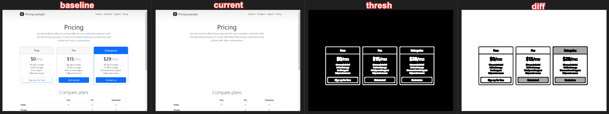

# ez_visual_regression

*Used to take screenshots with selenium (pages or elements) and compare to baseline*

## What does ez_visual_regression do?

`ez_visual_regression` is a library for helping do visual regression testing. This is a fancy name for taking a screenshot of a known-good version of your app, then every time you make changes you can compare your current app to those screenshots to make sure things don't break.



(larger images here )

For example `baseline` here is the "correct" version, we accidentally removed the pricing table in `current`, and we can see the difference in `diff` (and in higher contrast in `thresh`). This process is typically quite annoying and needs custom code. `ez_visual_regression` makes this much easier, and integrates natively with selenium, along with nice features (like ignoring elements).

## Features & Roadmap

On top of the standard

- Element ignoring; Using [query selectors (CSS Selectors)](https://developer.mozilla.org/en-US/docs/Web/CSS/CSS_selectors) you can select elements who's changes you want to ignore (i.e. hero's with changing images, or the text for commonly changing elements)
- Full page **or** element based; Allows you to decide if you want to make your tests by full page, or by element
- Warning and error thresholds; If you don't want to raise complete red flags you can set error thresholds to say if there "might" be a problem. This logs to `stderr`, which means you can be more liberal with your measurements without full pipeline failures
- Plug-n-play api; The API takes in any [non-headless (standard)](https://en.wikipedia.org/wiki/Headless_browser#:~:text=A%20headless%20browser%20is%20a,interface%20or%20using%20network%20communication.) webdriver. This means you can do **any selenium configuration** you want on the driver and then pass it into the api. It does no more and no less than what each of the functions say.
- Configuration based testing; You can always use the API if you want a code-based approach, or you can setup a config file and run from the cli

## Why should I use ez_visual_regression?

There are a ton of great and more robust tools out there for this analysis, or for visual regression testing, but I found each of them had their own problems, here's a list:

|Package|Issue|
|-------|-----|
|[needle](https://github.com/python-needle/needle)| Requires a Nose test runner, and had out of date dependencies|
|[pytest-needle](https://github.com/jlane9/pytest-needle) | Works well, but cannot use [webdiver_manager](https://pypi.org/project/webdriver-manager/) with it | 
|[dpxdt](https://github.com/bslatkin/dpxdt) | Didn't test, but was 7 years old and mostly focused on CI/CD usage|
|[Visual Regression Tracker](https://github.com/Visual-Regression-Tracker/Visual-Regression-Tracker) | Works great, but for some of my use cases I need an API not a full application|
|[hermione](https://github.com/gemini-testing/hermione)|Could not use javascript/nodeJS for my use case|
|[specter](https://github.com/letsgetrandy/specter)|Could not use javascript/nodeJS for my use case|
|[Cypress-image-screenshot](https://github.com/jaredpalmer/cypress-image-snapshot)|Could not use javascript/nodeJS for my use case|

So I build ez_visual_regression to fill in the gaps I saw in the available solutions. Namely being plug-n-play with any selenium driver to do whatever configurations I need!

## Who is ez-visual-regression for?

*If your package has multiple uses in seperate domains it may be worth explaning use cases in different domains; see [ahd](https://github.com/Descent098/ahd#who-is-ahd-for) for example*

## Quick-start

*Include how people can get started using your project in the shortest time possible*

### Installation

#### From source

1. Clone this repo: (put github/source code link here)
2. Run ```pip install .``` or ```sudo pip3 install .```in the root directory

#### From PyPi

1. Run ```pip install ez-visual-regression```

#### Examples

*Include an example or two of usage, or common use cases*

## Usage

*Include how to use your package as an API (if that's what you're going for)*

### Arguments

*If you are writing a script, include some helpful/often used arguments here. If you decide to use [docopt](http://docopt.org/) the usage string should do.* 

## Additional Documentation

*If you have any supplementary documentation elsewhere (i.e. https://readthedocs.org/) include references to it here.*
