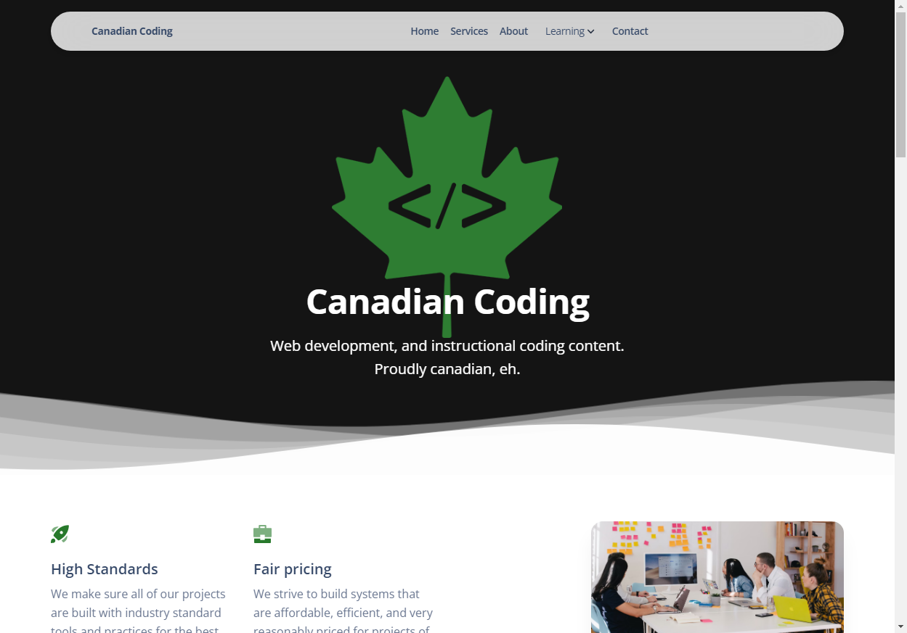
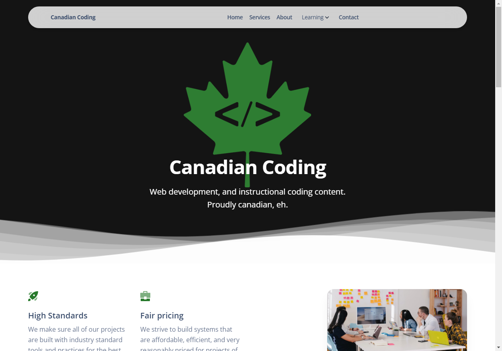
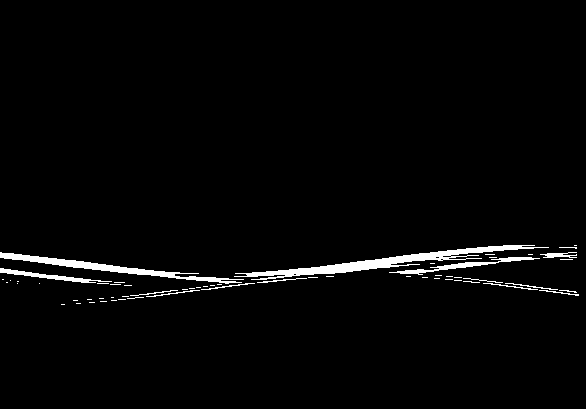

# Getting started

A guide for getting started using `ez_visual_regression`, designed to help make it easier to get up and running quickly!

*Please note all examples use [webdriver manager](https://pypi.org/project/webdriver-manager/) and Chrome. Neither of these are strictly required, any valid [non-headless (standard)](https://en.wikipedia.org/wiki/Headless_browser#:~:text=A%20headless%20browser%20is%20a,interface%20or%20using%20network%20communication.) browser with bindings will work (firefox, safari etc.)*

## Installation

### From source

1. Clone this repo: (put github/source code link here)
2. Run ```pip install .``` or ```sudo pip3 install .```in the root directory

### From PyPi

1. Run ```pip install ez-visual-regression```

## Using ez_visual_regression from the API

The most basic example is comparing a full page screenshot of a URL (you can also use a file path to an HTML file). If it's the first time you've run the utility it will generate some images in the folder you specify, see [the home page](/) for an explanation of these images. Once you've done the initial run and generated a baseline image, you can then just run the same code whenever you want to do visual regression testing. 

### Full page visual regresion testing

Here's the basic code:

```python
# Setup driver
from ez_visual_regression.api import get_installed_driver, instantiate_driver

driver_name = get_installed_driver()
driver = instantiate_driver(driver_name)

from ez_visual_regression.api import assert_image_similarity_to_baseline

# Configuration variables
URL = "https://canadiancoding.ca"
folder = "results"

# Creates baseline if one isn't available
assert_image_similarity_to_baseline(driver, URL, folder=folder)
```

You can also shorten this using built in system to instantiate a driver:

```python
from ez_visual_regression.api import assert_image_similarity_to_baseline, get_installed_driver, instantiate_driver

# Configuration variables
URL = "https://canadiancoding.ca"
folder = "results"

driver_name = get_installed_driver()
driver = instantiate_driver(driver_name)

# Creates baseline if one isn't available
assert_image_similarity_to_baseline(driver, URL, folder=folder)
```

We ended up with some decent results, but even compared to our baseline image there was a difference because of the page animations:

`baseline`

`current`

`thresh`

`diff`


At this point we could tweak the thresholds (see [advanced features](advanced_features.md#picking-a-threshold) for details), or we could ignore the animated element (see how to do this [here](advanced_features.md#ignoring-elements)).

### Element visual regresion testing

To test an individual element you just need to specify a `locator` parameter (needs to be a [Query/CSS selector](https://developer.mozilla.org/en-US/docs/Web/CSS/CSS_selectors)):

```python
# Setup driver
from ez_visual_regression.api import get_installed_driver, instantiate_driver

driver_name = get_installed_driver()
driver = instantiate_driver(driver_name)

from ez_visual_regression.api import assert_image_similarity_to_baseline

# Configuration variables
URL = "https://canadiancoding.ca"
folder = "results"
locator = "nav"

# Creates baseline if one isn't available
assert_image_similarity_to_baseline(driver, URL, folder=folder, locator=locator)
```

### Multiple element visual regression testing

To test multiple elements you just need to specify a `locator` parameter (needs to be a [Query/CSS selector](https://developer.mozilla.org/en-US/docs/Web/CSS/CSS_selectors)), and the `multielements` parameter:

```python
# Setup driver
from ez_visual_regression.api import get_installed_driver, instantiate_driver

driver_name = get_installed_driver()
driver = instantiate_driver(driver_name)

from ez_visual_regression.api import assert_image_similarity_to_baseline

# Configuration variables
URL = "https://canadiancoding.ca"
folder = "results"
locator = ".nav-item p"

# Creates baseline if one isn't available
assert_image_similarity_to_baseline(driver, URL, folder=folder, locator=locator, multielements=True)
```

## Using ez_visual_regression from the CLI

There's several ways to use ez_visual_regression from the cli. The two main ones are with a normal command, or a config. Normal commands are good for one-off systems, or systems with 1 test, configs are better for multiple tests.

### Normal commands

There are 2 options for normal commands:

```bash
ezvr screenshot <url> [-l locator] [-i ignored_elements] [-f folder] [-m]
ezvr test <url> [-l locator] [-i ignored_elements] [-f folder] [-w warning_threshold] [-e error_threshold] [-m]
```

screenshot will let you take a normal screenshot, only the URL is needed, everything else is optional. Test will do the normal tests you are expecting where there will be a baseline image generated then tested against.

### Config

You can also setup a config file and then access it using the command:

```bash
ezvr [<config_file>] [-h] [-v]
```

For details about how to use the config file checkout [this page](advanced_features.md#configuration-files)
