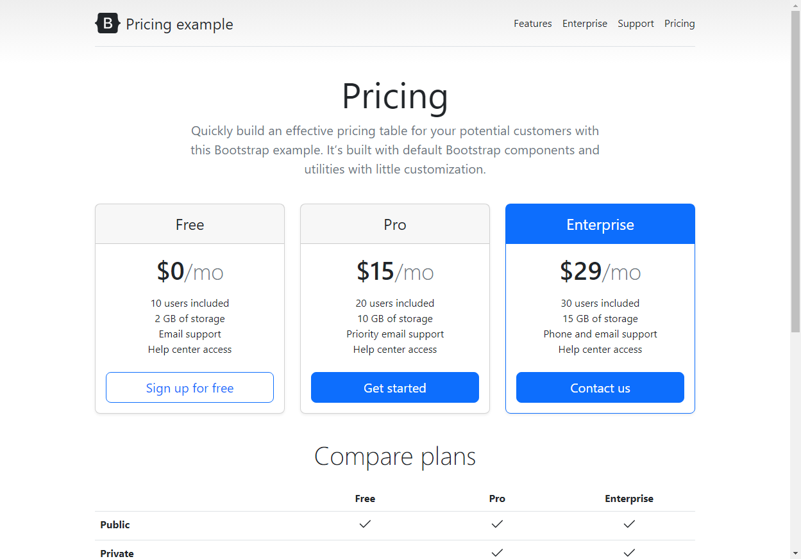
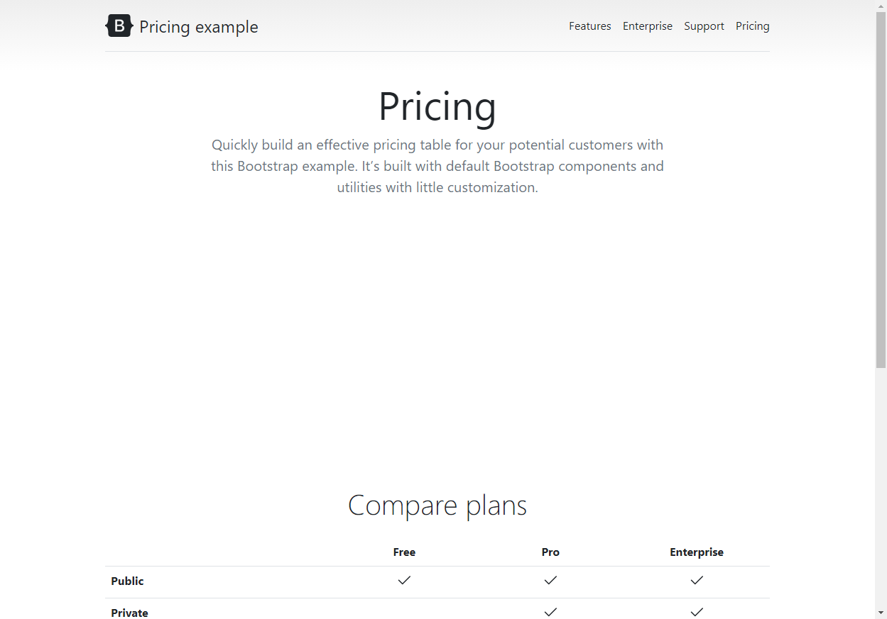
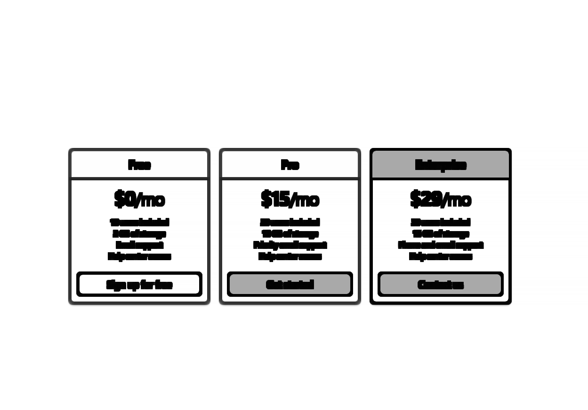
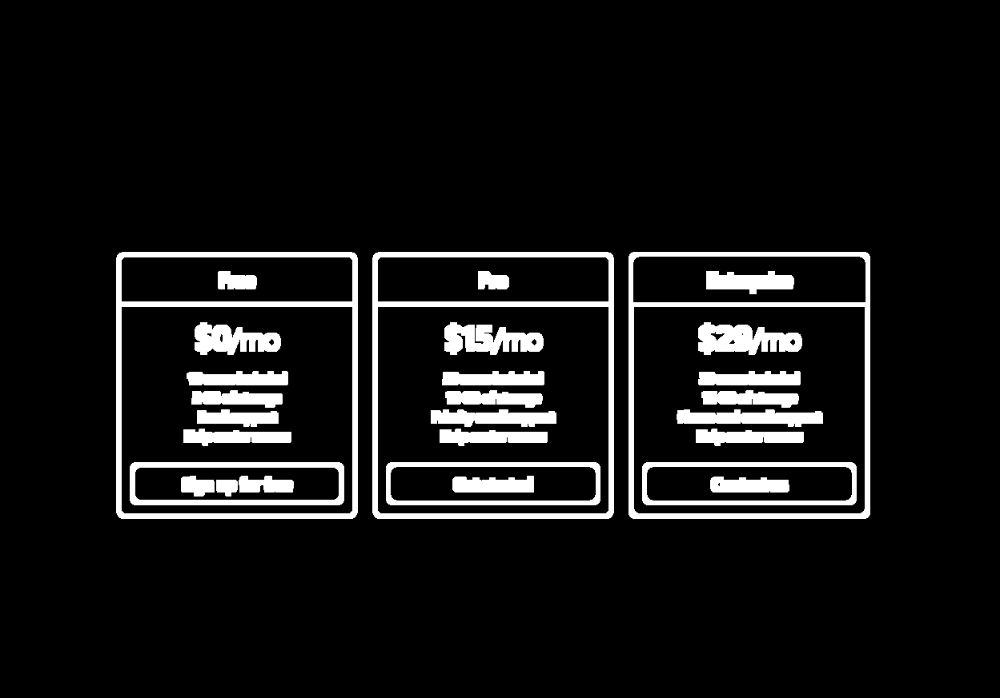

# ez_visual_regression

*Used to take screenshots with selenium (pages or elements) and compare to baseline*

## What is visual regression testing?

Visual regression testing is a fancy name for a type of testing that exists where you are looking to visually inspect a program, and confirm what should be there is there, and what shouldn't isnt. This typically means having a dedicated person come in and look at every page after a change and see if they can spot the difference. 

This is not a good approach:

- It wastes people's time
- It's highly error prone
- Because of the two above it's rare people follow through on doing it, instead they just assume it works and don't test
- Sometimes there's reference images for the "correct state", but often people get lazy and try to do it from memory

So what can we do...

### How does ez_visual_regression do visual regression testing?

ez_visual_regression is a tool that uses [selenium](https://selenium-python.readthedocs.io/index.html) a web automation platform to go to a set of pages you specify and compare their current state to a "baseline" image taken during a known-good state. This way you can easily automate this sort of testing across dozens of pages, and have them run on vaious different triggers (every few days/weeks/months, every push), or just help as a "sanity check" on top of existing testing. 

When you initially run the system after configuring it (see getting started for details), on the first run it will generate a set of images in your configured folder, the most important being the `baseline.png`. The `baseline.png` image will be used to denote a "known-good state", and in subsequent runs it will compare the current state to that baseline to confirm it works properly. After a run there will be 4 images generated (here's an example):

1. `baseline.png`; The "correct" version of the page/element

2. `current.png`; The current version (right now as of running)

3. `diff.png`; The difference between the two images visualized

4. `thresh.png`; A high contrast difference between the two images (shows where the largest differences are)

In this case we accidentally removed the pricing table compared to `baseline.png` in `current.png`, and we can see the difference in `diff.png` (and in higher contrast in `thresh.png`). 

## Features & Roadmap

On top of just normal visual regression ez_visual_regression supports:

- Element ignoring; Using [query selectors (CSS Selectors)](https://developer.mozilla.org/en-US/docs/Web/CSS/CSS_selectors) you can select elements who's changes you want to ignore (i.e. hero's with changing images, or the text for commonly changing elements)
- Full page **or** element based; Allows you to decide if you want to make your tests by full page, or by element
- Warning and error thresholds; If you don't want to raise complete red flags you can set error thresholds to say if there "might" be a problem. This logs to `stderr`, which means you can be more liberal with your measurements without full pipeline failures
- Plug-n-play api; The API takes in any [non-headless (standard)](https://en.wikipedia.org/wiki/Headless_browser#:~:text=A%20headless%20browser%20is%20a,interface%20or%20using%20network%20communication.) webdriver. This means you can do **any selenium configuration** you want on the driver and then pass it into the api. It does no more and no less than what each of the functions say.
- Configuration based testing; You can always use the API if you want a code-based approach, or you can setup a config file and run from the cli

## Why should I use ez_visual_regression?

There are a ton of great and more robust tools out there for this analysis, or for visual regression testing, but I found each of them had their own problems, here's a list:

|Package|Issue|
|-------|-----|
|[needle](https://github.com/python-needle/needle)| Requires a Nose test runner, and had out of date dependencies|
|[pytest-needle](https://github.com/jlane9/pytest-needle) | Works well, but cannot use [webdiver_manager](https://pypi.org/project/webdriver-manager/) with it | 
|[dpxdt](https://github.com/bslatkin/dpxdt) | Didn't test, but was 7 years old and mostly focused on CI/CD usage|
|[Visual Regression Tracker](https://github.com/Visual-Regression-Tracker/Visual-Regression-Tracker) | Works great, but for some of my use cases I need an API not a full application|
|[hermione](https://github.com/gemini-testing/hermione)|Could not use javascript/nodeJS for my use case|
|[specter](https://github.com/letsgetrandy/specter)|Could not use javascript/nodeJS for my use case|
|[Cypress-image-screenshot](https://github.com/jaredpalmer/cypress-image-snapshot)|Could not use javascript/nodeJS for my use case|

So I build ez_visual_regression to fill in the gaps I saw in the available solutions. Namely being plug-n-play with any selenium driver to do whatever configurations I need!

## Source code and contributing

All code is licensed under MIT license, and you can find the source code [here](https://github.com/Descent098/ez-visual-regression)
